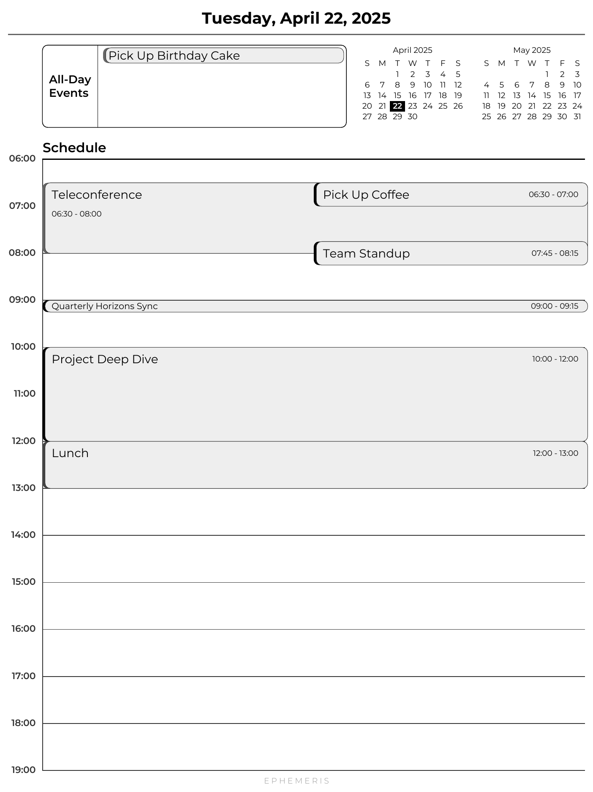
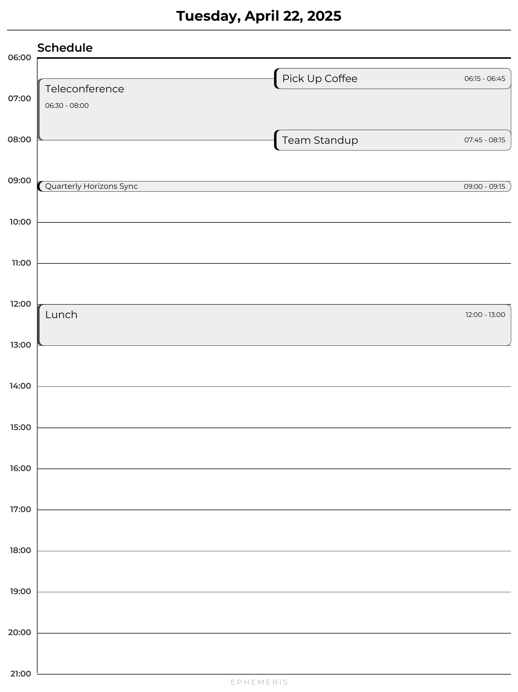
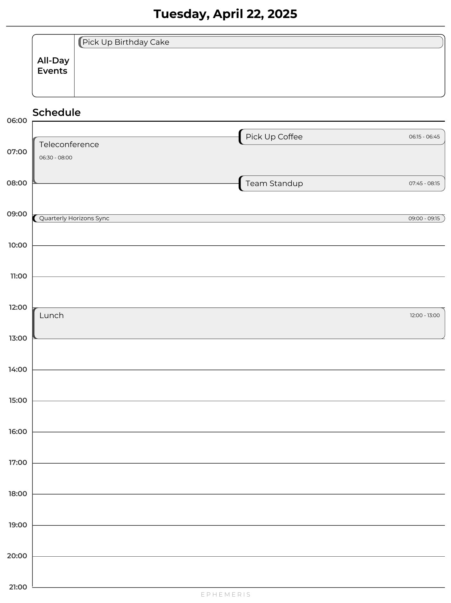
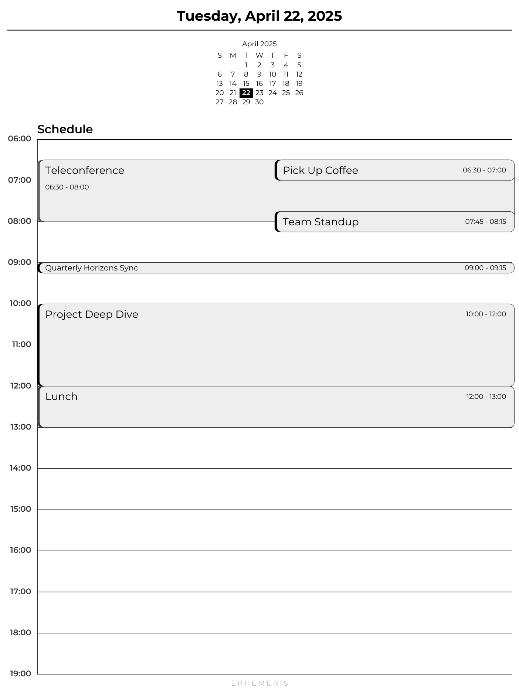
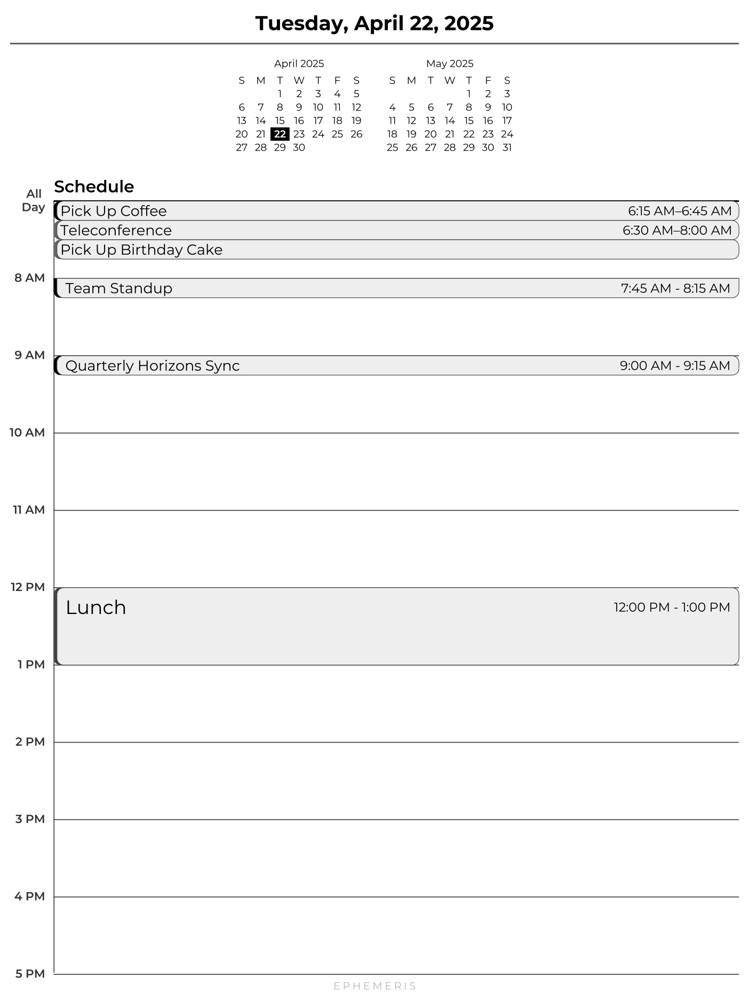

# Ephemeris


[](https://remarkable.com/store/remarkable)
[](https://remarkable.com/store/remarkable-2)
[](https://remarkable.com/store/overview/remarkable-paper-pro)
> Your daily path through time.


Ephemeris is a Python-based tool that generates clean, daily schedules using ICS calendar data. Designed with e-ink tablets like reMarkable and Kindle Scribe in mind.

## Features

- **Automated Schedule Generation**: Seamlessly convert ICS calendar data into organized daily planners.
- **Customizable Layout**: Adjust your daily schedule's layout, timeframe, and appearance via environment variables.
- **Elegant PDF Output**: Clean PDFs designed specifically for e-ink devices.
- **Links to Days**: Mini-Calendar days are clickable links.

## Screenshots

These screenshots broadly show the layout options that are possible. See [Customization](#customization--supported-environment-variables) for more information.

<p float="left">
  <a href="assets/example-default.png">
    
  </a>
  <a href="assets/example-grid-only.png">
    
  </a>
  <a href="assets/example-grid-allday.png">
    
  </a>
    <a href="assets/example-centercal.png">
    
  </a>
  </a>
    <a href="assets/example-allday-ingrid.png">
    
  </a>
</p>

## Getting Started

### Calendar Configuration

The program uses a YAML configuration file to set up the calendars:
```yaml
calendars:
  - name: Personal
    source: calendars/personal.ics
    color: gray6
  - name: US Holidays
    source: https://www.opm.gov/policy-data-oversight/pay-leave/federal-holidays/holidays.ics
    color: gray4

```
Supported values for colors are CSS names, hex colors, as well as a series of grays (gray1 through gray14) that correspond to each step of 4-bit grayscale.

### Docker Compose

```yaml
services:
  ephemeris:
    image: ghcr.io/rmitchellscott/ephemeris
    volumes:
      - ./calendars:/app/calendars
      - ./output:/app/output
      - ./config.yaml:/app/config.yaml
      - ./feeds_meta.yaml:/app/feeds_meta.yaml  # Used for change detection
    environment:
      - TIME_ZONE=America/Denver
      - TIME_DATE_RANGE=week
```

### Docker
```shell
docker run --rm \
  -v "$(pwd)/calendars:/app/calendars" \
  -v "$(pwd)/output:/app/output" \
  -v "$(pwd)/config.yaml:/app/config.yaml" \
  -v "$(pwd)/feeds_meta.yaml:/app/feeds_meta.yaml" \
  -e TIME_ZONE=America/Denver \
  -e TIME_DATE_RANGE=week \
  ghcr.io/rmitchellscott/ephemeris
```

### Python
#### Setup

- Python 3.8+
- Dependencies: `cairosvg`, `icalendar`, `loguru`, `PyPDF2`, `pytz`, `pyyaml`, `reportlab`, `requests`, `webcolors`

Install dependencies with:

```bash
pip install requirements.txt
```

Set environment variables to customize the output:

```bash
export TIME_ZONE="America/New_York"
```
Run the script:

```bash
python ephemeris.py
```
## Common Device Parameters

#### reMarkable 1
```shell
DOC_PAGE_DIMENSIONS=1404x1872
DOC_PAGE_DPI=226
```
#### reMarkable 2
```shell
DOC_PAGE_DIMENSIONS=1404x1872
DOC_PAGE_DPI=226
```
#### reMarkable Paper Pro
```shell
DOC_PAGE_DIMENSIONS=1620x2160
DOC_PAGE_DPI=229
```
#### Kindle Scribe*
```shell
DOC_PAGE_DIMENSIONS=1860x2480
DOC_PAGE_DPI=300
```
#### Boox Note Air2 Plus
```shell
DOC_PAGE_DIMENSIONS=1404x1872
DOC_PAGE_DPI=227
```
#### Boox Tab Ultra
```shell
DOC_PAGE_DIMENSIONS=1404x1872
DOC_PAGE_DPI=227
```
#### Kobo Elipsa 2E
```shell
DOC_PAGE_DIMENSIONS=1404x1872
DOC_PAGE_DPI=227
```
#### Supernote A5 X
```shell
DOC_PAGE_DIMENSIONS=1404x1872
DOC_PAGE_DPI=226
```

#### TRMNL**
```shell
DOC_PAGE_DIMENSIONS=480x800
DOC_PAGE_DPI=125
```
<sub>*Information seems hard to find for the Kindle Scribe. If any of these values need correction, please open a GitHub Issue.</sub>\
<sub>**DPI might not be correct, will have a device for testing ~May 2025.</sub>

## Customization & Supported Environment Variables

### Time Configuration

| Variable            | Default        | Example                          | Description                                                                          |
|:--------------------|:---------------|:---------------------------------|:-------------------------------------------------------------------------------------|
| TIME_DATE_RANGE     | today          | today, week, month, 2025-04-14:2025-04-18 | Date range to create schedules for. Each day will be a single page. A single multi-page PDF will be rendered.   |
| TIME_DISPLAY_END    | 21             | 21                               | Defines the ending hour of the displayed daily schedule.                             |
| TIME_FILTER_MIN_HOUR| 0              | 4                                | Excludes events with start times before this hour from the generated schedule.       |
| TIME_DISPLAY_START  | 6              | 6                                | Defines the starting hour of the displayed daily schedule.                           |
| TIME_ZONE           | UTC            | America/New_York                 | Sets the timezone used for interpreting event times.                                 |
| TIME_FORMAT         | 24             | 12, 24                           | Specifies time formatting in 12-hour or 24-hour formats.                             |

### Application Configuration

| Variable            | Default                   | Example               | Description                                                         |
|:--------------------|:--------------------------|:----------------------|:--------------------------------------------------------------------|
| APP_CONFIG_PATH     | {BASE_DIR}/config.yaml   | /path/to/config.yaml   | Path to the configuration file.                                     |
| APP_META_FILE_PATH  | {BASE_DIR}/feeds_meta.yaml| /path/to/meta.yaml    | Path to the feeds metadata file.                                    |
| APP_OUTPUT_FORMAT   | pdf                      | pdf, png, both         | Output format for the generated schedule.                           |
| APP_OUTPUT_PDF_PATH | output/ephemeris.pdf     | reports/schedule.pdf   | Path and name for rendered output file.                             |
| APP_OUTPUT_PNG_DIR  | output/png               | reports/images         | Directory for rendered output PNG files, one per day.               |
| APP_FORCE_REFRESH   | false                    | true, false            | Skip the changed events check and always render a document for each run. |
| APP_LOG_LEVEL       | INFO                     | VISUAL, EVENTS, DEBUG, INFO, WARNING   | Minimum log level to output to console. EVENTS is useful for troubleshooting why events are appearing or not. VISUAL shows detailed drawing information for developer debugging.                         |
| APP_LOG_COLORIZE    | true                     | true, false            | Whether to use ANSI colors in console log output.                   |
| APP_LOG_FORMAT      | (see description)        | custom format string   | Loguru format string for console output. Default includes timestamp, level, and message. |

### Document Rendering

| Variable                    | Default                   | Example                | Description                                                                          |
|:----------------------------|:--------------------------|:-----------------------|:-------------------------------------------------------------------------------------|
| DOC_COVER_SVG_PATH          | {BASE_DIR}/assets/cover.svg | /path/to/cover.svg   | Path to the SVG file used for the cover page.                                        |
| DOC_COVER_ENABLED           | true                     | true, false             | Print a cover page with SVG as the rendered document's first page.                        |
| DOC_COVER_WIDTH_SCALE       | 0.75                     | 0 - 1                   | Scale factor for the cover SVG width relative to page width.                         |
| DOC_COVER_VERTICAL_POSITION | 0.25                     | 0 - 1                   | Vertical position factor for placing the cover SVG on the page.                      |
| DOC_ALLDAY_BOUNDARY         | grid                     | grid, page              | Select the left boundary for the "All-Day Events" band, either the main time grid or the left margin. |
| DOC_ALLDAY_MODE             | band                     | band, in-grid, disabled | Set to `band` to draw the All-Day Events in their own band at the top, set to `in-grid` to draw all day events in the "zeroth" hour of the main time grid, set to `disabled` to disable All-Day Events from being drawn. |
| DOC_ALLDAY_OVERFLOW         |  true                    | true, false        | When true, events outside the main time grid hours are shown with All-Day Events. | 
| DOC_MINICAL_MODE            | full                     | full, current, false    | `full` will draw mini-calendars for the current and next month, `current` will draw only the current month, `disabled` will disable. |
| DOC_MINICAL_LINKS           | true                     | true, false             | Add links to mini-cal days that have pages rendered. |
| DOC_MINICAL_INDICATE_RANGE  | true                     | true, false             | Indicate which days are in the document by slightly bolding them in the mini-calendars. |
| DOC_MINICAL_ALIGN           | right                    | center, right, left     | Horizontal alignment for the mini-calendars. Center and Left are available when `DOC_ALLDAY_MODE` is set to anything other than `band`. |
| DOC_MINICAL_HEIGHT          | 60                       | 40                      | Height of mini-calendars and All-Day Events area in points (1pt = 1/72in).           |
| DOC_MINICAL_SPACING         | 10                       | 12                      | Gap between each calendar, and between calendars and other elements. In points (1pt = 1/72in). |
| DOC_MINICAL_TEXT_PADDING    | 5                        | 8                       | Padding around text in mini-calendars in points (1pt = 1/72in).                      |
| DOC_MINICAL_POSITION_OFFSET | 0                        | 5                       | Offset adjustment for mini-calendar positioning in points (1pt = 1/72in).            |
| DOC_EVENT_FILL_COLOR        | gray14                   | black, gray0, #000000   | Color for the background of events. CSS names, Ephemeris gray names, and hex supported. |
| DOC_EVENT_BORDER_COLOR      | gray(20%)                | black, gray0, #000000   | Color for the outline of events. CSS names, Ephemeris gray names, and hex supported. |
| DOC_FOOTER_TEXT             | E P H E M E R I S        | updatedat, disabled, My Cool Footer | Set to `updatedat` to print the "Updated at" timestamp, `disabled` to disable, or any text you want. |
| DOC_FOOTER_COLOR            | gray(60%)                | black, gray0, #000000   | Color for the page footer. CSS names, Ephemeris gray names, and hex supported.       |
| DOC_GRID_LINE_COLOR         | gray(20%)                | black, #000000          | Color for the time grid lines. CSS names, Ephemeris gray names, and hex supported.   |
| DOC_PAGE_DIMENSIONS         | 1404x1872                | 1080x1920               | Resolution for rendered document.       
| DOC_PAGE_DPI                | 226                      | 300                     | DPI/PPI for rendered document.                                                            |                                                |
| DOC_MARGIN_LEFT             | 6                        | 12                      | Left page margin in points (1pt = 1/72in).                                           |
| DOC_MARGIN_RIGHT            | 6                        | 12                      | Right page margin in points (1pt = 1/72in).                                          |
| DOC_MARGIN_TOP              | 9                        | 12                      | Top page margin in points (1pt = 1/72in).                                            |
| DOC_MARGIN_BOTTOM           | 6                        | 12                      | Bottom page margin in points (1pt = 1/72in).                                         |
| DOC_GRID_BOTTOM_PADDING     | 9                        | 12                      | Buffer between the bottom of the grid and the bottom margin in points (1pt = 1/72in). Useful for having a footer. |

## License

MIT

---

Enjoy precisely organized days with Ephemeris!
